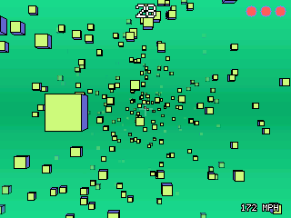

# Blockamok

Blockamok Remix on the NumWorks calculator: you fly a spaceship through a wormhole full of blocks, and the throttle keeps going up. How far can you get?



- **Same game:** the same spawning, speed curve, hit box, lives, invincibility blink and scoring as Blockamok Remix.
- **Same options:** block frequency, block size, lives, spawn area, background, block and overlay colors, block transparency and speedometer, kept with your high score.
- **Small:** 3 numbers per block instead of 60, blocks kept in distance order without sorting, and drawing by bands of 30 rows with no frame buffer.

## Controls
- **Arrows** (or 8 4 6 2): turn. **OK** or **Back**: hold to speed up.
- **EXE:** start, pause. **Back:** options from the title, quit from the pause.
- **Backspace:** show or hide the cursor.

The Konami-style codes of Blockamok Remix are still there: Up Down Left Right twice resets the high score, and in the pause menu Up Up Up Down Down Down Left Right Left Right Left toggles debug mode.

## Build
```
make          # output/blockamok.nwa
make check    # output/blockamok.bin, linked like the calculator does
make host     # desktop test build, with scripted keys and screenshots
```

## Credits
Blockamok by [Carl Riis](https://github.com/carltheperson/blockamok), Blockamok Remix by [Mode8fx](https://github.com/Mode8fx/blockamok). MIT License.
